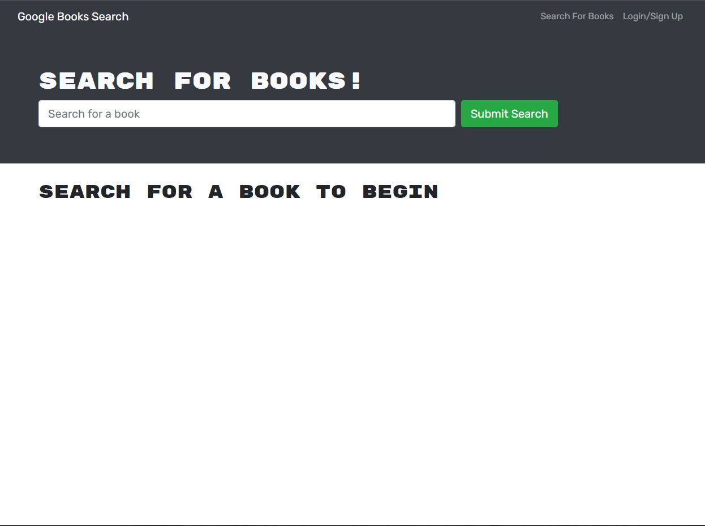
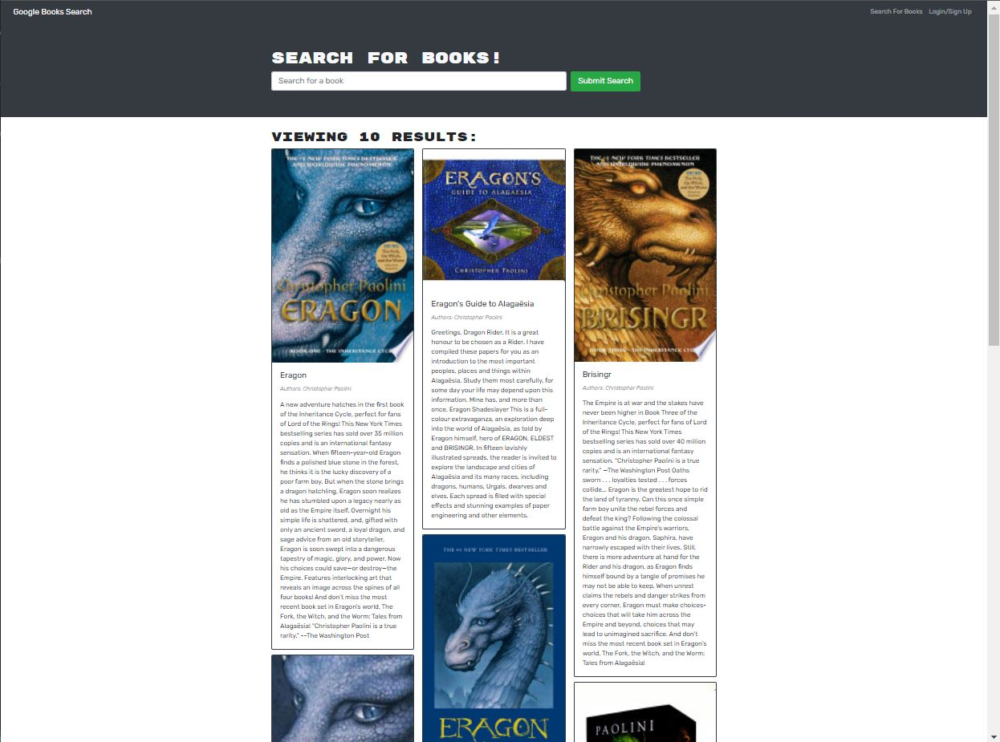
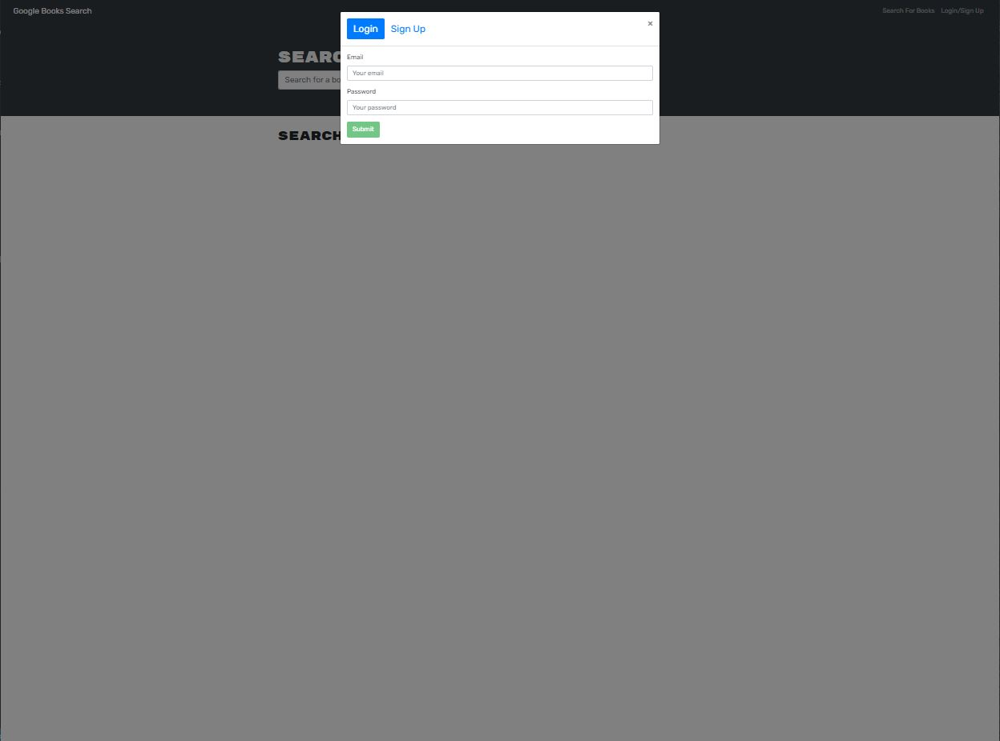
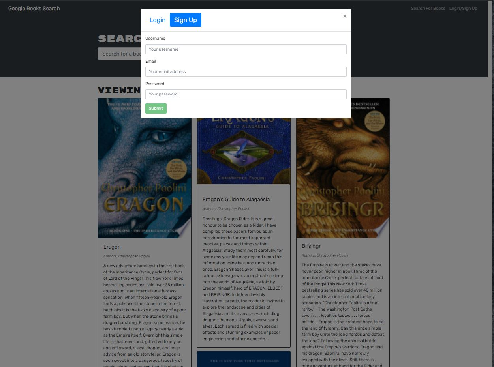

# Book Collector

## Description

The reason behind this application is to build a website that allows a user to search books by their title or author, and make a collection of their facvorite books on their profile.

## Installation

When downloaded from github, the package.json will already be prepared. All that needs to be done is run the integrated terminal at the root level
```
npm i
```
This will download the library necessary to run the program.

In development stages, from the root level run 
```
npm run develop
```
this will allow you to run both the client and server on the backend

## Usage

- At the begining we see the home page is a serach bar and a login/sign up button.



- A user can still look up a book even though they are not logged in. However, they will not be able to save them.



- A user can login in an signup, their information is stored on a database online.





## Issues

- A user can sign up and login however they cannot add or save books. For some reason when I deployed it, the saving and removing book functions became depricated


# Future Implimentations

The goal would be to fix the saving books feature to allow signed in users to be able to view the books they saved.